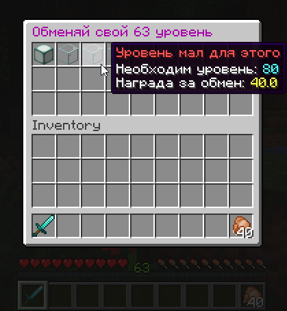

# SellLevel

The plugin allows you to **sell / exchange** your **level** for currency.
Just enter the command to select an exchange:
 - */sell-lvl*
 - */sell-lvl max* (immediately select the maximum)

### What is MineCraft plugin
I think you know the answer to this question if you got here.

### What's been done so far
The project is doubtfully alive, but if you have suggestions for improvements, please contact.

- [X] Commands
- [X] List of exchange options
- [ ] Translate messages into English
- [X] Objects in the config exchange list
- [X] GUI Interface

### Download
No updated releases are currently available.

### Compiling
Clone the repo recursively and then run `mvn clean package` or Maven default Goal. The output jar will can be found at `target/SellLevel-x.x.x.jar`.

### Libraries used
* [Spigot-API Library](https://hub.spigotmc.org/stash/projects/SPIGOT)
* [VaultAPI by MilkBowl](https://github.com/MilkBowl/VaultAPI)
